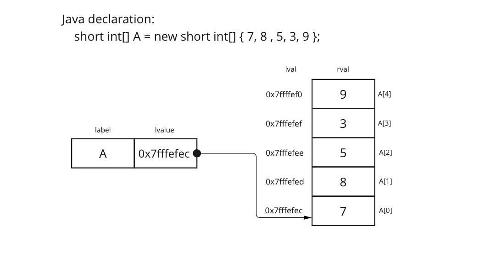

## MIPS-122 ISA:

MIPS-122 is just a simplified version of MIPS. Moreover, we provide a set of corresponding Three Address Code (TAC) statements for a subset of instructions.

  * TAC Instructions and corresponding subset MIPS Instructions
  
    1. Instructions
       - virtual registers: a, b, etc.  (name starts with a lowercase)
       - physical registers: $t0, $t1, etc.
       - memory references
         - text reference: label
         - data references: A, B, etc. (name starts with uppercase)
       - `<cond>`:  <, <=, ==, !=, >=, >

       | TAC Instruction               | MIPS Instruction          |
       |-------------------------------|---------------------------|
       | `nop`                         | `nop`                     |
       | `x = [ a \| imm ]`            | `li, move`                |
       | `x = a [+\|-] [ b \| imm ]`   | `add, sub, addi, subi`    |
       | `x = a * b`                   | `mul`                     |
       | `x = a >> imm`                | `srl`                     |
       | `if  a <cond> b, goto label`  | `b<cond> a, b, label`     |
       | `if! a <cond> b, goto label`  | `b<! cond>, a, b, label`  |
       | `goto label`                  | `b label`                 |
       | `x = & A`                     | `la x, A`                 |
       | `x = (* a)`                   | `lb x, 0(a)`              |
       | `call label`                  | `jal label`               |
       | `return`                      | `jr $ra`                  |

    1. Data types:
       - integers: 0-255 (0 .. 2^8 -1)
       - arrays: integers
    1. Registers:  
       - 8 bits wide
       - $t0, $t1, $t2, $t3, then growing as needed
    1. Memory:
       - addressable: byte
       - only .text, data, stack
    1. OS Interface
       - exit  
  
---
## Iteration via a For Loop

  1. Consider Multiplication via successive additions
     * Java implementation
       ```java
       product = 0;
       for ( i = 1 ; i <= b ; i ++ ) {
         product = product + a;
       }
       result = product
       ```
 1. Issues:
     * Problem 6: Need to break down the semantics of the for-loop
     * Problem 7: Need reduce the number of jumps

   ```java
         product = 0;
         i = 1; 
   top:  for (; i <= b ;) {          // if! i <= b, done
           product = product + a;

           i ++;

           continue top;
         }
   done: ;
         result = product;
   ```


   ```TAC
            product = 0;
            i = 1; 
   top:     if! i <= b , done
               product = product + a;
     
               i = i + 1;

               goto top; 
   done:    ;
            result = product;
   
   ```


   ```mips
              # Register allocation
              # t0: a 
              # t1: b
              # t2: product
              # t3: i 
              # t4: result

              move $t2, $zero       # product = 0;
              li $t3, 1             # i = 1; 
   top:       bgt $t3, $t1, done    # if! i <= b , done
                add $t2, $t2, $t0     #   product = product + a;
                addi $t3, $t3, 1      #    i = i + 1;
                b top                 #    goto top; 
                                    # 
   done:      nop                   # ;
              move $t4, $t2         # result = product;
   
   ```
 ---
## Accessing an Array

  1. Reduction of an Array via Addition
     * Consider the following Java version
       ```java
       sum = 0;
       for ( i = 0 ; i < A.length ; i ++ ) {
         sum += A[i];
       }
       result = sum;
       ```
 
     * A Simplified Java Version
       ```java
       sum = 0;

       length = A.length;
       ref_A = A;

       i = 0;
       for (; i < length ;) {
       	 value = ref_A[i];
         sum += value;

         i++;
       }
       result = sum;
       ```

  1. Depiction of an Array of Integers

     

    * Revised Algorithm to walk an array via a pointer

    * A simplified C version
       ```C
       sum = 0;

       length = <size of A>;                # Length has to be provided
       pointer_A = &A;

       i = 0;
       for (; i < length ;) {
       	 value = (* pointer_A);
         sum += value;

         pointer_A ++;

         i ++; 
       }
       result = sum;
       ```

  1. Transform into TAC code
     ```
            sum = 0

            length = <size of Array> 
            pointer_A = &A

            i = 0           	            
     top:   nop        
   
            if i >= length, goto done        
              value = (* pointer_A)
              sum = sum + 1
             
              pointer_A = pointer_A + 1

              i = i + 1                      
              goto top
     done:  nop
     result = sum
     ```

  1. Write the MIPS code fragment
     ```
     start:
               # Register Allocation


     end:
     ```

## Processing of the argv Data Structure
  1. Update the ISA
     - Instruction now includes
       - `x = (* a)`  => `lw x, 0(a)`

     - Data types:
       - integers: 0-255 (0 .. 2^8 -1)
       - addresses: 0 .. 2^32-1 

     - Registers:  
       - 8 => 32 bits wide

     - OS Interface:  via macros define in "syscalls.s"
       - print_d  _reg_   # print a decimal value, value is in _reg_
       - print_s  _reg_   # print a string, address is in _reg_
       - print_ci _imm_   # print a char, the value is _imm_
       - exiti _imm_      # exit with a value, the value is _imm_

  1. Framework of the main subroutine
     ```
     int main( int argc, char * argv[]) {

       exit(0);     # java.lang.System.exit() 
     }
     ```

  1. Depiction of the argv Data Structure
     - ``$ mars echo.c pa one two three four``

     

  1. Processing of argv via TAC
      ```
      main:   nop

              length = argc
              pointer_A = argv                 # argv is already an address

              i = 0           	               
      top:    nop        
   
              if i >= length, goto done        
                str = (* pointer_A)           # str is  an address 
                
                # do some processing on the string
             
                pointer_A = pointer_A + 4     # addresses are 4 bytes

                i = i + 1                      
                goto top
      done:   nop
      ```

   1. Process of arv in MIPS
      - This is your assignment!
      ```
              .data
              .text
              .globl main
              .include "syscalls.s"

      main:   nop
              # Formal Arguments
              # a0: 
              # a1: 
              # a2: 
              # a3: 
              # v0: 

              # Register Allocation

              # De-marshal Inputs

              #################
              # The body


              #################
              # Marshal Output
              move $v0, $<return>
              exiti 0

      ```